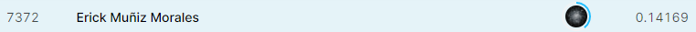

# Proyecto 1 - Seminario de Inteligencia Artificial

### Kaggle Competition - House Prices - Advanced Regression Techniques

Una regresión lineal simple para el proyecto de precios de casas. 

- Tenemos > 70 variables explicativas. 
- **Objetivo:** Dar el precio de la casa en cuestión.

[Link a Kaggle](https://www.kaggle.com/c/house-prices-advanced-regression-techniques/data)

# Puntuación en Kaggle Tableboard

